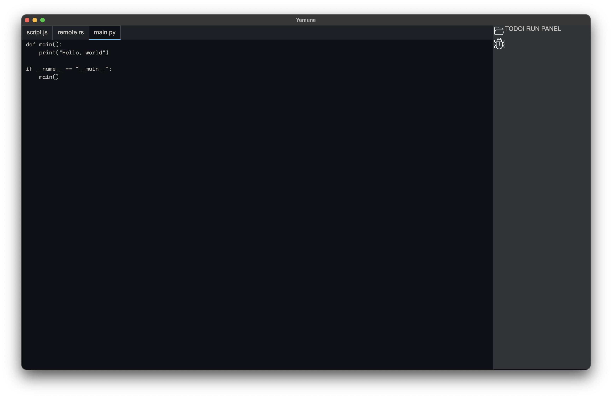

# Yamuna is an IDE built with Tauri and Rust.
## Yamuna is a holy river in India 🇮🇳 which is where I got this name from

## Progress:
1 Of April:


2 of April first half of the day:

[Progress of Yamuna](Progress/april-2-1-showcase.mp4)


---
### Icon attributions:
```html
<a href="https://www.flaticon.com/free-icons/bug" title="bug icons">Bug icons created by Freepik - Flaticon</a>
<a href="https://www.flaticon.com/free-icons/folder" title="folder icons">Folder icons created by cahiwak - Flaticon</a>
```
